<p align="center">
  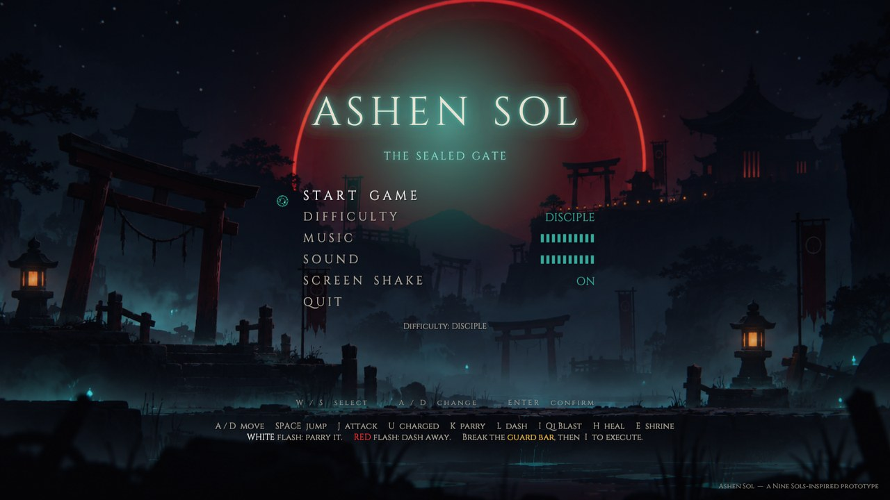
</p>

<h1 align="center">ASHEN SOL</h1>
<p align="center"><em>The Sealed Gate</em></p>

<p align="center">
  <strong>A parry-driven 2D action game in the vein of <em>Nine Sols</em></strong><br>
  Taopunk — Taoist temple ruins meet cyberpunk.<br>
  Four chapters, two bosses, a closing credits roll. All of it built from code at runtime.
</p>

<p align="center">
  
  
  
  
</p>

---

## Contents

* [The run](#the-run) · [Playing](#playing) · [Controls](#controls)
* [The rule of the fight](#the-rule-of-the-fight) · [Ash, death and levelling](#ash-death-and-levelling)
* [The final boss](#the-final-boss-the-second-form) · [Difficulty](#difficulty)
* [Project layout](#project-layout) · [Tools](#tools) · [Environment](#known-quirks-of-this-environment)

---

## The run

<p align="center">
  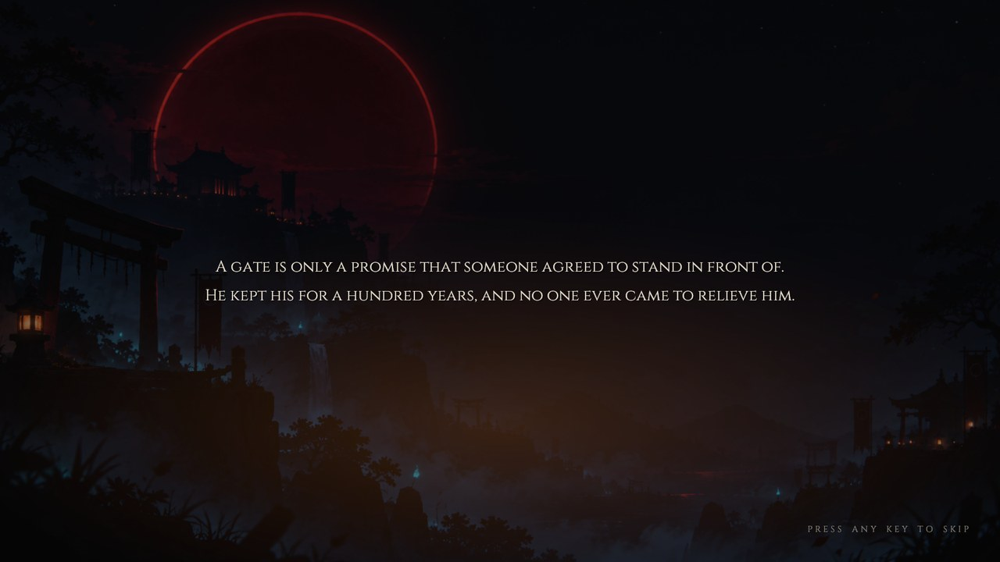
</p>

> *"A gate is only a promise that someone agreed to stand in front of.
> He kept his for a hundred years, and no one ever came to relieve him."*

| # | Level | What's in it |
|---|---|---|
| I | **THE OUTER SANCTUM** | A corridor of enemies, platforming, a sealed gate |
| II | **THE SUNKEN WORKS** | Qi fountains, lift platforms, ladders, then **THE SEVENTH ARTISAN** |
| III | **THE PILGRIM STAIR** | Mandatory interlude: a stairway, a jumping passage, a gauntlet, a shrine — and the **Foundry Brute** with his hammer |
| IV | **THE SEALED GATE** | **THE FORSAKEN WARDEN** — with a cinematic turn into **ASH UNBOUND** |

Credits roll afterwards, with music of their own.

<p align="center">
  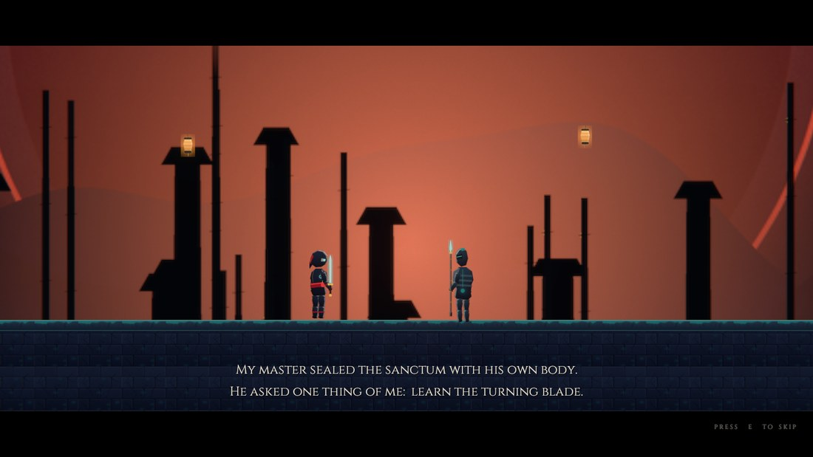
</p>
<p align="center"><sub>The spoken intro — fully voiced, skippable with <code>E</code>.</sub></p>

<p align="center">
  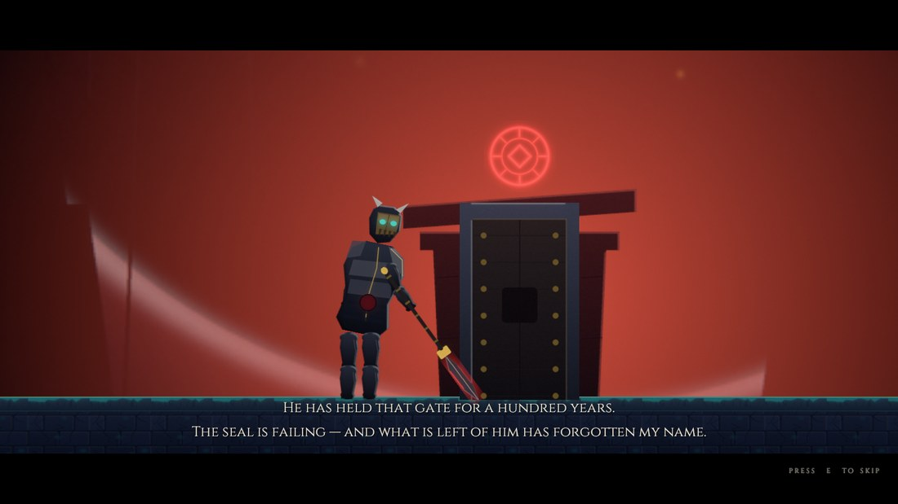
</p>
<p align="center"><sub>A hundred years at his post. The intro tells you who he was before you have to kill him.</sub></p>

---

## Playing

Finished build: **`Builds/Windows/AshenSol.exe`** — just double-click it.

### Controls

| Action | Keyboard | Gamepad (Xbox) | PlayStation |
|---|---|---|---|
| Move | A / D | Left stick, D-pad ←→ | Left stick, D-pad ←→ |
| Jump | Space / W | **A** | Cross |
| Attack | J / Left click | **R1** | R1 |
| **Charged attack** | U | **R2** | R2 |
| **Parry** | K / Right click | **LB** | L1 |
| Dash | L / Shift | **X** | Square |
| Qi Blast / **Execution** | I | **LT** | L2 |
| Heal | H | **D-pad ↑** | D-pad ↑ |
| **Rest at a shrine** / skip a cutscene | E / F | **Y** | Triangle |
| Pause | Esc | Start | Options |
| Confirm (menus) | Enter / Space | **A** | Cross |
| Abandon the run (while paused) | Q | **X** | Square |

Climbing and moving up and down in menus run off the **left stick** — D-pad up is bound to healing,
otherwise a ladder would keep firing off heals.

---

## The rule of the fight

<table>
<tr>
<td width="50%">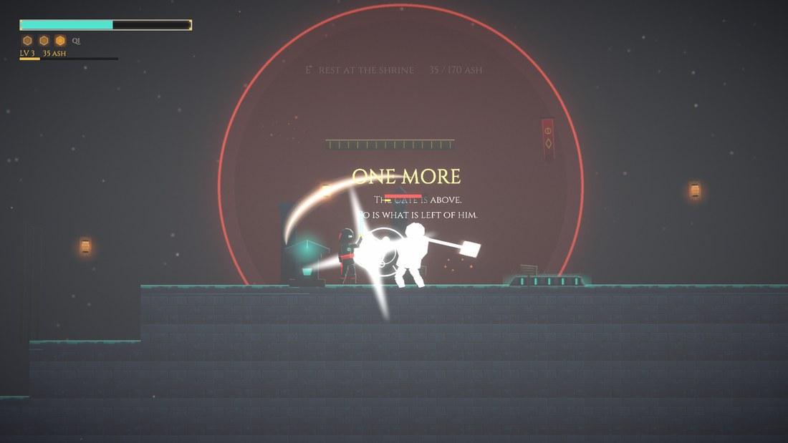</td>
<td width="50%">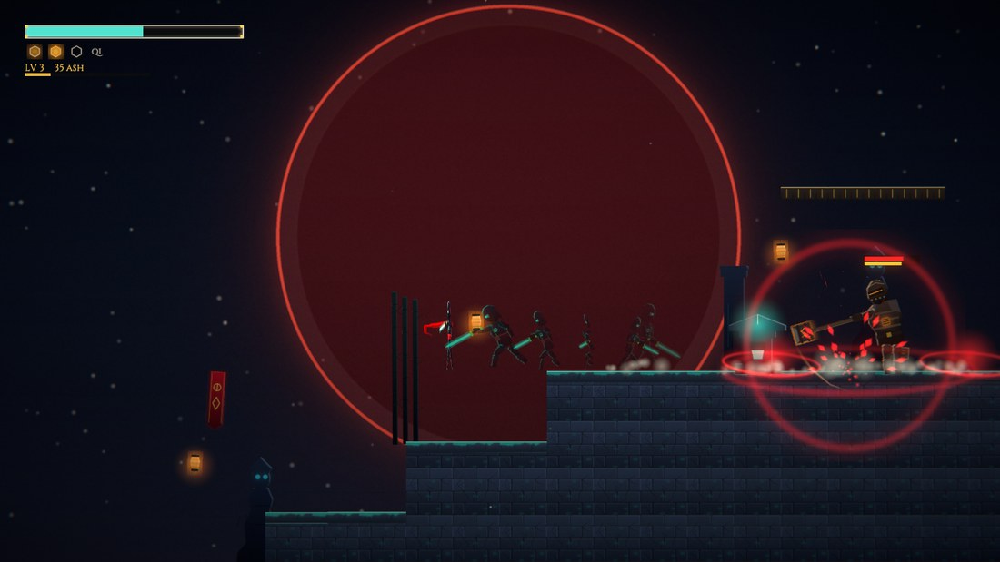</td>
</tr>
<tr>
<td><sub><strong>White</strong> means parryable. The Brute takes two perfect parries — after the first, "ONE MORE" hangs over him.</sub></td>
<td><sub><strong>Red</strong> means unblockable. Parrying will not save you: dash out or jump it.</sub></td>
</tr>
</table>

* **A white flash** = a parryable attack → press **K** on the beat.
  A perfect parry: no damage, +1 Qi, and a lot of **posture damage** on the yellow bar.
  A little late: a block, with 30 % of the damage getting through (and it fills the yellow bar only a quarter as fast).
* **A red flash** = unblockable → parrying does nothing, **dash away or jump**.
* Every enemy carries **two bars**: red is health, yellow is **posture**.
  Fill the yellow one and their **guard breaks**: they are **defenceless for 3 seconds**,
  take double damage, and a pulsing **I** appears above them.
* **Execution: `I`** next to a broken enemy → costs 1 Qi and does massive damage
  (Grunt 60, Sentinel 85, Drone 45, Brute 95, Boss 130). Their posture bar empties afterwards.
* **Ordinary enemies break on a single perfect parry.** The **Foundry Brute** (hammer, from
  Level III onwards) **takes two** — after the first, "ONE MORE" appears above him. The **boss takes three** —
  his three-hit combo exists for exactly that.
* Posture regenerates after 1.6 s of calm. Stop pressing and you lose the progress.
* With no target in range, `I` stays the **Qi Blast**: 12 damage in a radius plus heavy
  posture damage — good for cracking a whole group open at once.
* Enemy projectiles can be **knocked back** with a perfect parry (30 damage).
* **Charged attack (`U` / R2):** a 0.46 s wind-up, then a single overhead blow for
  **34 damage** (instead of 10/10/18), with a wider hitbox, heavy knockback and **22 % posture damage
  in one hit** — three times what a normal strike does. It cannot be folded into the combo, and you are
  committed during the wind-up: anyone who hits you there interrupts it.

**Qi** (max 3, the golden hexagons): +1 per perfect parry and per kill. Spend it on the
**Execution (I)**, the **Qi Blast (I with no target)** or **healing (H)**.

<p align="center">
  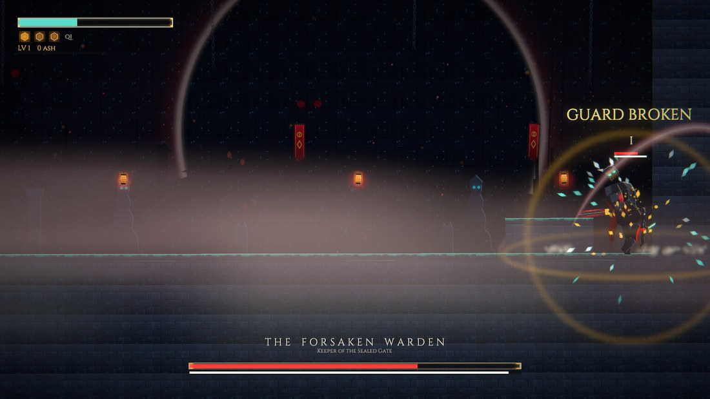
</p>
<p align="center"><sub>Yellow bar full → <strong>GUARD BROKEN</strong>. A three-second window, double damage, then <code>I</code>.</sub></p>

---

## Ash, death and levelling

<p align="center">
  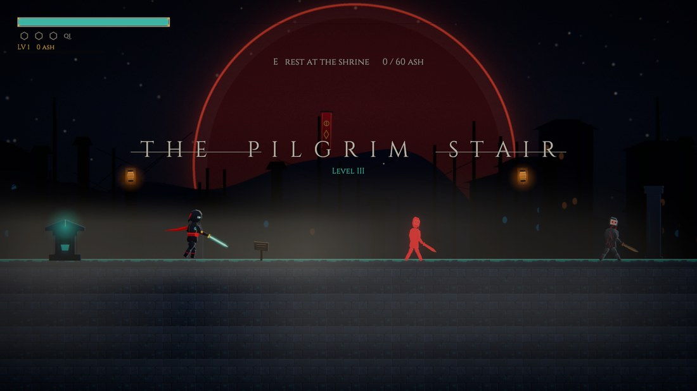
</p>

The game is built like a soulslike:

* Every kill pays out **ASH** (Grunt 22, Sentinel 34, Drone 16, Brute 55, Artisan 190, Warden 260).
  Ash is **carried, not banked** — it sits top left under the Qi bar.
* **Die and all of it drops where you fell.** A pile smoulders on the spot; walk back and
  you get everything. **Die again before you reach it and it is gone** — the new pile replaces the old one.
* **Shrines are checkpoints and levelling in one.** Stand at a shrine and press
  **E** — the music ducks, the camera moves in, the singing bowl rings, and then the menu opens.
  It never opens on its own.
* A level costs `60 + (level−1) × 55` ash and tempers **one** attribute:

  | | Effect |
  |---|---|
  | **VIGOR** | +10 max health (heals you on the spot) |
  | **EDGE** | +6 % sword damage |
  | **FOCUS** | +1 max Qi (up to +2) |

---

## The final boss: the second form

<table>
<tr>
<td width="50%">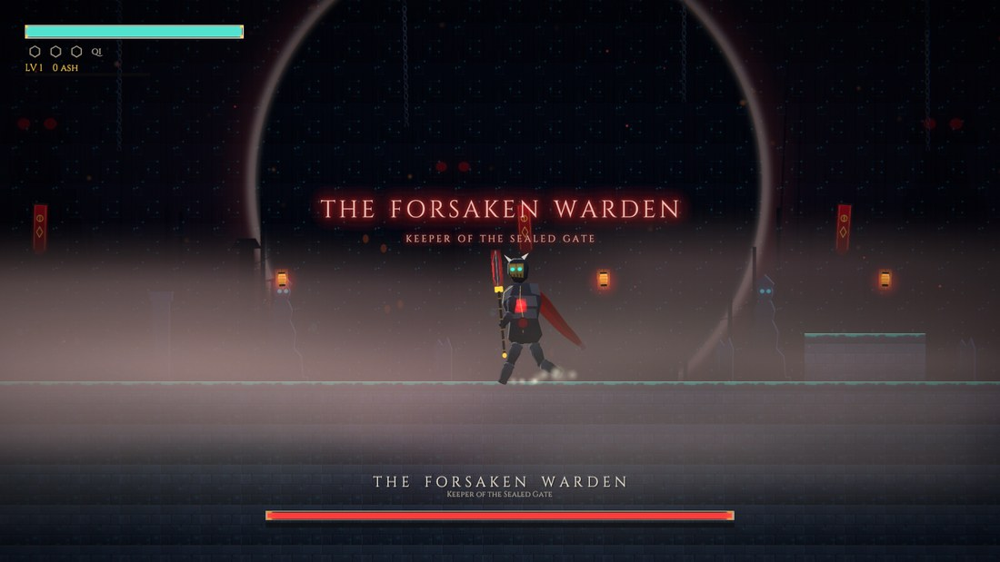</td>
<td width="50%">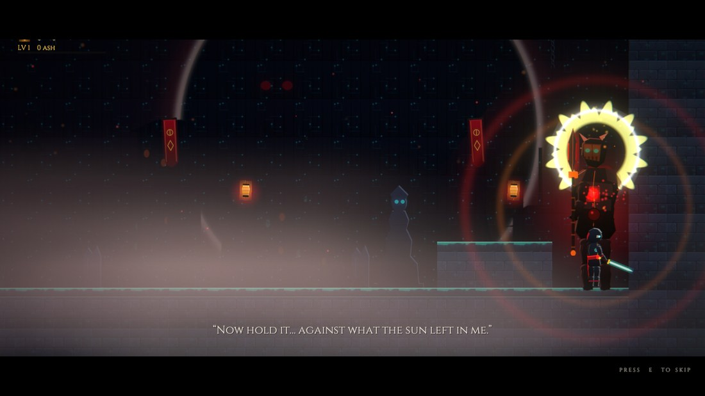</td>
</tr>
<tr>
<td><sub><strong>Phase 1</strong> — the warden in front of the gate he has held for a century.</sub></td>
<td><sub><em>"Now hold it… against what the sun left in me."</em> — at 55 % health the fight turns over.</sub></td>
</tr>
</table>

At 55 % health a **roughly 20-second cutscene** plays (skippable with any key):
the Warden goes down, the bar empties, the music stops — and the ash inside him takes the body
back. Behind the mask the crown of the ninth sun catches fire, he stands up again as **ASH UNBOUND**,
glowing in embers and afterimages from then on, and gains two new attacks:

* **GORE CHARGE** — a head-down charge that ends in a ground wave.
* **SOLAR COLLAPSE** — he drives the glaive into the floor and pulls a small sun out of the crown.
  It opens the second form and comes back every 17 seconds after that.
  **Running is not an option — the blast fills the entire arena.**
  Parried perfectly it costs nothing; blocked late it still takes 60 %;
  not parried at all, **three quarters of your whole health bar**. The moment to parry is
  when the sun collapses in on itself.

<p align="center">
  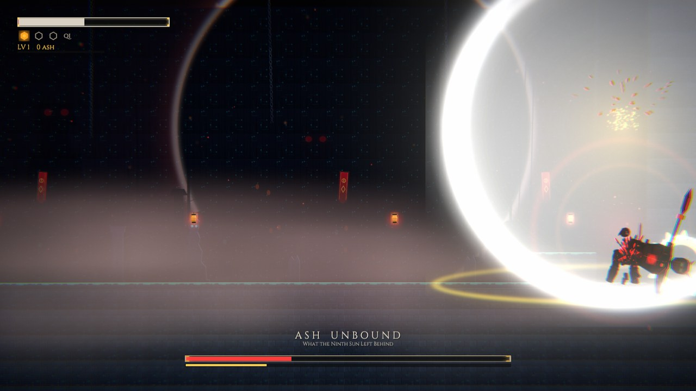
</p>
<p align="center"><sub><strong>SOLAR COLLAPSE.</strong> There is nowhere to run — only the one moment when the sun caves in.</sub></p>

---

## Difficulty

Switchable from the title menu (and remembered):

| | DISCIPLE | SOL SLAYER |
|---|---|---|
| Perfect parry window | 0.22 s | 0.14 s |
| Damage taken | ×0.8 | ×1.3 |
| Enemy telegraphs | ×1.12 (longer) | ×0.9 (faster) |
| Healing | 40 HP | 30 HP |

The menu also holds music and sound volume, and a screen-shake toggle.

<p align="center">
  
</p>
<p align="center"><sub>The run gets scored: time, parries, deaths, damage taken.</sub></p>

---

## Project layout

```
nine_sols/
├─ AshenSol/            Unity project (Unity 6000.4.6f1, URP 2D, Input System, uGUI)
│  └─ Assets/_Game/
│     ├─ Scripts/       Core, Player, Enemies, Boss, Level, UI, VFX, Audio
│     ├─ Shaders/       Silhouette + SpriteAdditive (URP)
│     ├─ Resources/     Sprites, Audio/SFX, Audio/Music, Fonts
│     ├─ Scenes/Main.unity   the only scene: one GameBootstrap object
│     └─ Editor/        Bootstrap, build script, import post-processors
├─ Tools/               SPEC.md and every script (see below)
├─ AudioRaw/            raw ElevenLabs output + sfx_map.txt (kept out of git)
├─ Screenshots/         autopilot captures (kept out of git)
├─ docs/img/            the screenshots used in this README
└─ Builds/Windows/      the built player
```

**Everything is built from code at runtime** — no prefabs, no hand-authored scene. Levels,
player, enemies, boss, UI and effects all come into being in `LevelBuilder`,
`PlayerController.Create` and friends.

The characters are procedural puppets: joint hierarchies of individual sprites, with a knee and an
elbow in every limb, and Verlet cloth for sash and cape. The hips drop by whatever height the legs
lose to their own bend, so the lowest foot stays planted on the floor in every pose — including
mid-transition and through an authored attack clip.

## Tools

| Script | Purpose |
|---|---|
| `Tools/compile.sh` | Compile check + project bootstrap (layers, shaders, player settings, scene) |
| `Tools/build.sh` | Build the Windows player into `Builds/Windows/AshenSol.exe` |
| `Tools/autopilot.sh [sec]` | Play the build with a bot; screenshots + log land in `Screenshots/` |
| `Tools/gen_sprites.py` | Regenerate every procedural sprite (Pillow) + `Tools/contact_sheet.png` |
| `Tools/import_audio.py` | Trim, normalise and copy the raw ElevenLabs files into the project |
| `Tools/fix_packages.sh` | Works around a Unity 6000.4.6f1 bug in the ShaderGraph package (runs automatically) |

The autopilot (`-autopilot`) swaps input for a bot that parries, dashes, crosses the level,
levels up at the shrine and beats the boss. It ends by writing a line
`AUTOPILOT RESULT: reachedGate=… bossDefeated=… exceptions=…` — the fastest regression test there is.
**Every screenshot in this README comes from an autopilot run.**

Useful flags:

| Flag | Effect |
|---|---|
| `-skipTitle -startLevel works\|stair\|boss` | Jump straight into a chapter |
| `-introSeconds <sec>` | How long the bot watches the intro before skipping it (default 12) |
| `-bossPhase 2` | Open the Warden fight with the transformation (`Builds/AnimReview/AshUnbound.bat`) |
| `-victoryHold <sec>` | How long the bot keeps playing after the win (for the credits) |
| `-mute` | Sound off (always set for automated runs) |

## Known quirks of this environment

* On the first failed compile, Unity 6000.4.6f1 corrupts files inside the ShaderGraph package.
  `Tools/fix_packages.sh` restores them and adds the missing `using` — it runs before every
  build automatically.
* Package extraction occasionally fails with `EPERM`; the scripts retry on their own.
* `GUI/Text Shader` must **never** end up in "Always Included Shaders" — it breaks the player build.
