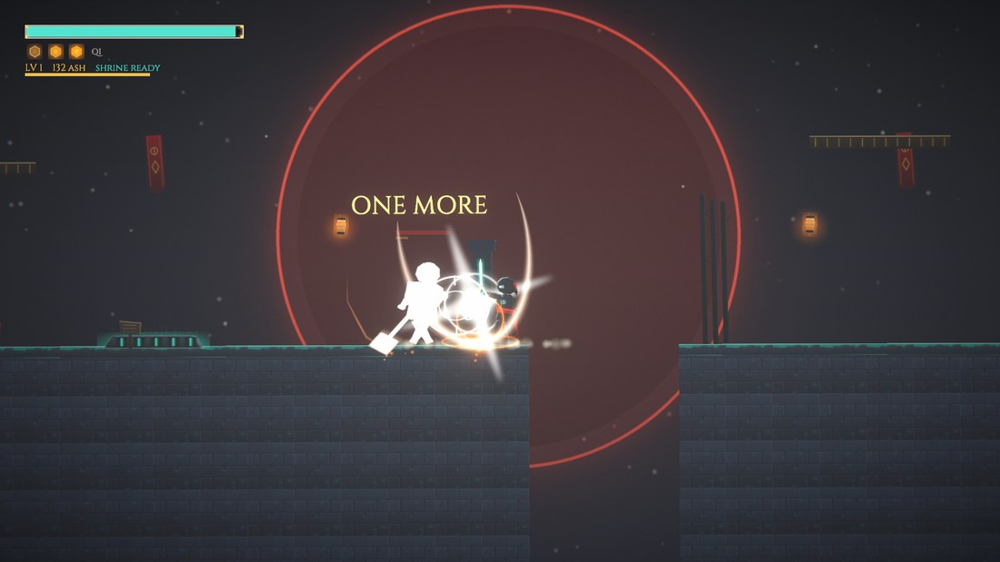
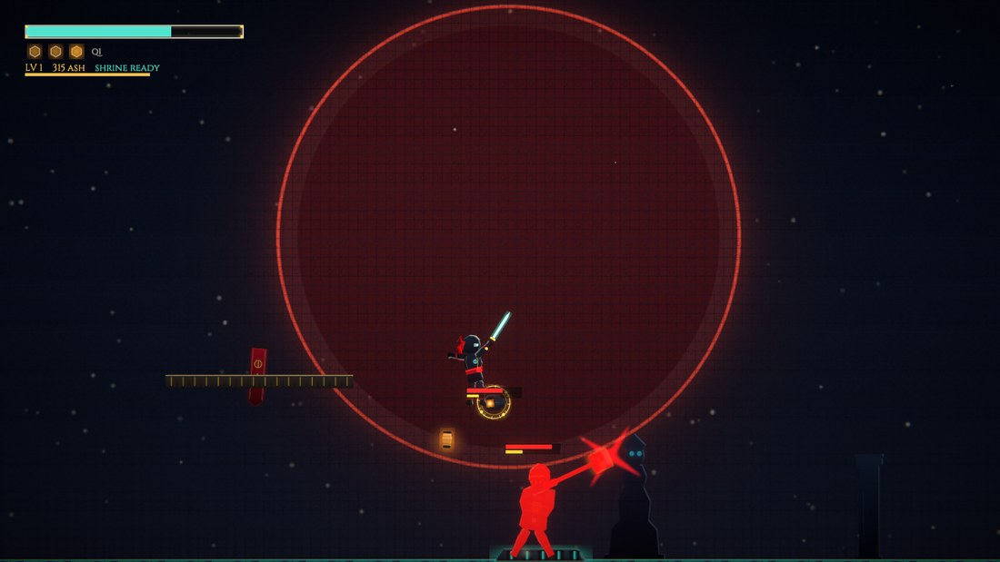
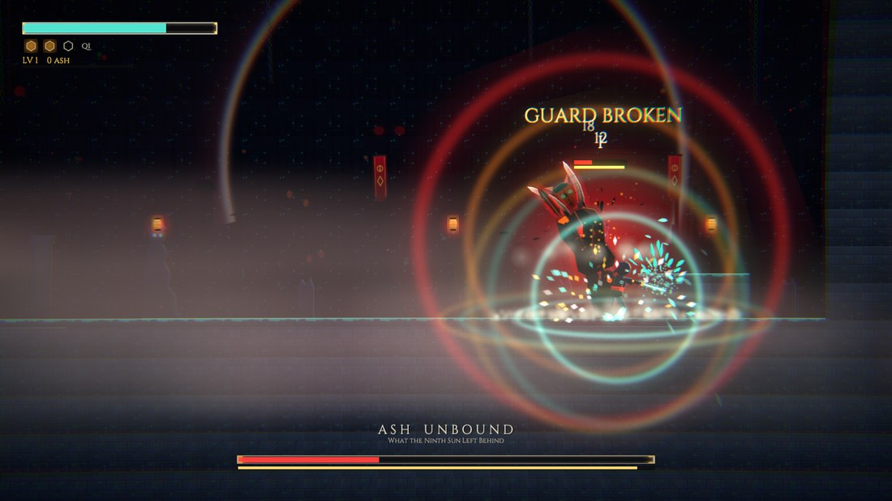
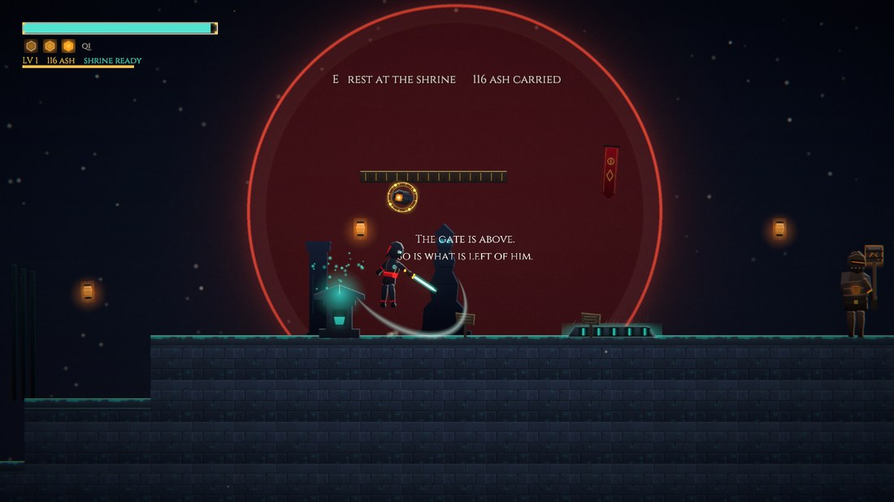
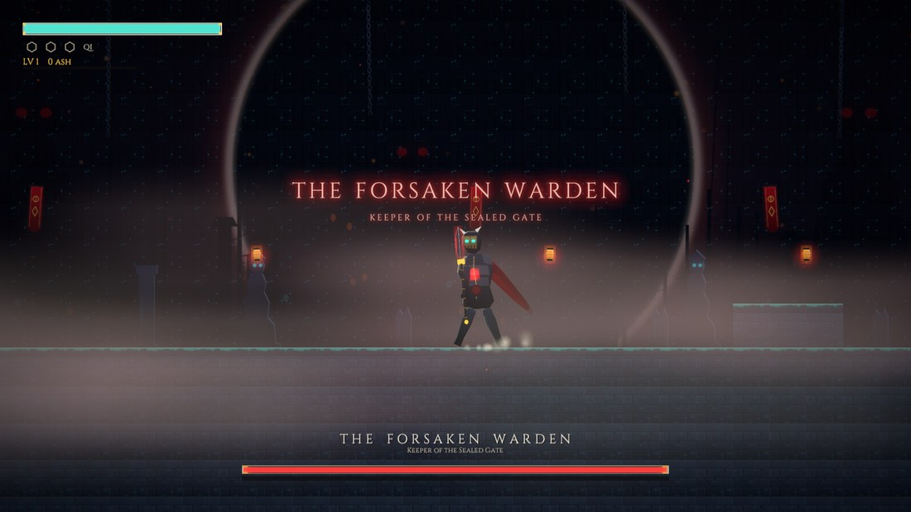
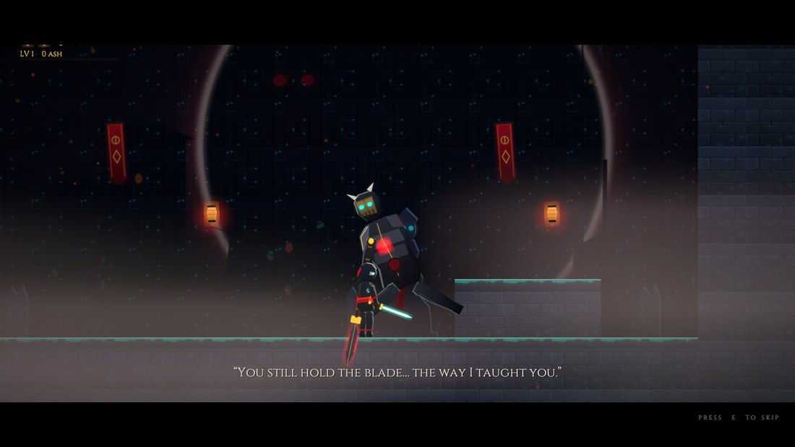
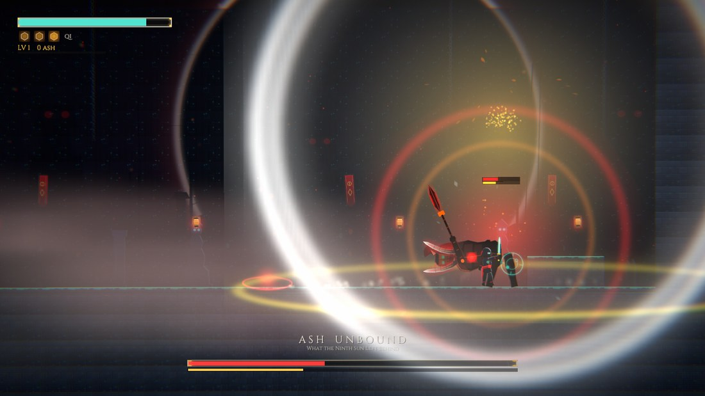
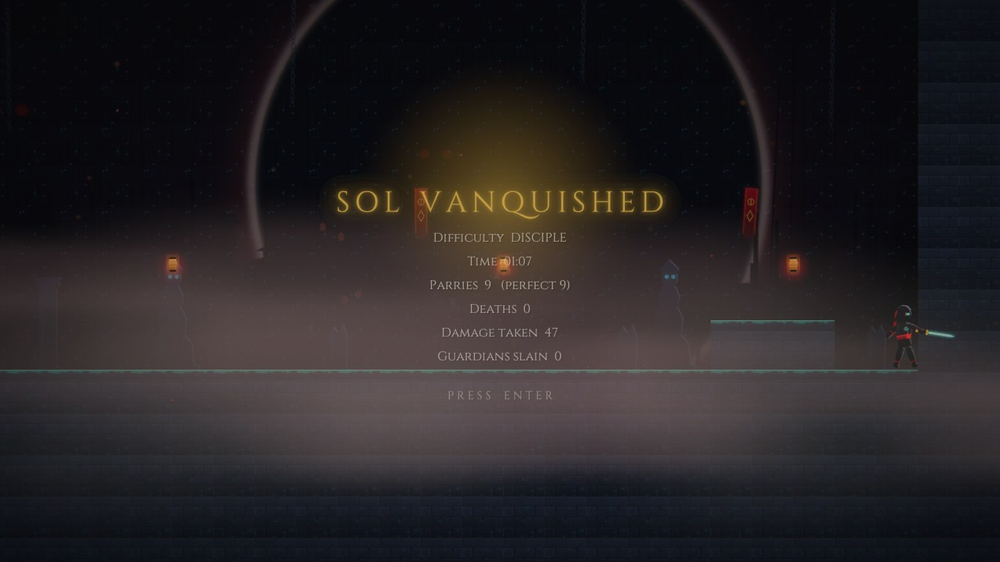

<p align="center">
  
</p>

<h1 align="center">ASHEN SOL</h1>
<p align="center"><em>The Sealed Gate</em></p>

<p align="center">
  <strong>Ein parry-lastiges 2D-Action-Spiel im Stil von <em>Nine Sols</em></strong><br>
  Taopunk — Taoisten-Tempelruinen treffen Cyberpunk.<br>
  Vier Abschnitte, zwei Bosse, ein Abspann. Alles zur Laufzeit aus Code gebaut.
</p>

<p align="center">
  
  
  
  
</p>

---

## Inhalt

* [Der Lauf](#der-lauf) · [Spielen](#spielen) · [Steuerung](#steuerung)
* [Die Kampfregel](#die-kampfregel) · [Asche, Tod und Leveln](#seelen-asche-tod-und-leveln)
* [Der Endboss](#der-endboss-die-zweite-form) · [Schwierigkeitsgrade](#schwierigkeitsgrade)
* [Projektaufbau](#projektaufbau) · [Werkzeuge](#werkzeuge) · [Umgebung](#bekannte-eigenheiten-der-umgebung)

---

## Der Lauf

<p align="center">
  
</p>

> *„Ein Tor ist nur ein Versprechen, vor das sich jemand gestellt hat.
> Er hielt seines hundert Jahre lang, und niemand kam je, um ihn abzulösen."*

| # | Level | Inhalt |
|---|---|---|
| I | **THE OUTER SANCTUM** | Korridor mit Gegnern, Plattforming, versiegeltes Tor |
| II | **THE SUNKEN WORKS** | Qi-Fontänen, Fahrstuhl-Plattformen, Leitern, dann **THE SEVENTH ARTISAN** |
| III | **THE PILGRIM STAIR** | Pflicht-Zwischenlevel: Treppe, Sprungpassage, Gauntlet, Schrein — und der **Foundry Brute** mit dem Hammer |
| IV | **THE SEALED GATE** | **THE FORSAKEN WARDEN** — mit cineastischem Übergang in **ASH UNBOUND** |

Danach läuft ein Abspann mit eigener Musik.

<p align="center">
  
</p>
<p align="center"><sub>Das gesprochene Intro — vertont, überspringbar mit <code>E</code>.</sub></p>

---

## Spielen

Fertiger Build: **`Builds/Windows/AshenSol.exe`** — einfach doppelklicken.

### Steuerung

| Aktion | Tastatur | Gamepad (Xbox) | PlayStation |
|---|---|---|---|
| Bewegen | A / D | Linker Stick, D-Pad ←→ | Linker Stick, D-Pad ←→ |
| Springen | Leertaste / W | **A** | Kreuz |
| Angreifen | J / Linksklick | **R1** | R1 |
| **Aufgeladene Attacke** | U | **R2** | R2 |
| **Parieren** | K / Rechtsklick | **LB** | L1 |
| Dash | L / Shift | **X** | Quadrat |
| Qi-Blast / **Hinrichtung** | I | **LT** | L2 |
| Heilen | H | **D-Pad ↑** | D-Pad ↑ |
| **Am Schrein rasten** / Zwischensequenz überspringen | E / F | **Y** | Dreieck |
| Pause | Esc | Start | Options |
| Bestätigen (Menüs) | Enter / Leertaste | **A** | Kreuz |
| Lauf aufgeben (in Pause) | Q | **X** | Quadrat |

Klettern und die Menü-Auswahl oben/unten laufen über den **linken Stick** — das D-Pad hoch ist mit
Heilen belegt, sonst würde eine Leiter dauernd Heiltränke auslösen.

---

## Die Kampfregel

<table>
<tr>
<td width="50%"></td>
<td width="50%"></td>
</tr>
<tr>
<td><sub><strong>Weiß</strong> = parierbar. Der Brute braucht zwei perfekte Paraden — nach der ersten steht „ONE MORE" über ihm.</sub></td>
<td><sub><strong>Rot</strong> = unblockbar. Parieren hilft nicht: wegdashen oder drüberspringen.</sub></td>
</tr>
</table>

* **Weißes Aufblitzen** = parierbarer Angriff → im richtigen Moment **K** drücken.
  Perfekte Parade: kein Schaden, +1 Qi, und viel **Haltungsschaden** auf der gelben Leiste.
  Etwas zu spät: Block mit 30 % Restschaden (füllt die gelbe Leiste nur ein Viertel so schnell).
* **Rotes Aufblitzen** = unblockbar → Parieren hilft nicht, **wegdashen oder springen**.
* Jeder Gegner hat **zwei Leisten**: rot = Leben, gelb = **Haltung**.
  Ist die gelbe Leiste voll, **bricht die Deckung**: der Gegner ist **3 Sekunden wehrlos**,
  nimmt doppelten Schaden, und über ihm erscheint ein pulsierendes **I**.
* **Hinrichtung: `I`** neben einem gebrochenen Gegner → kostet 1 Qi, richtet massiven Schaden an
  (Grunt 60, Sentinel 85, Drohne 45, Brute 95, Boss 130). Danach ist die Haltungsleiste wieder leer.
* **Normale Gegner brechen bei einer einzigen perfekten Parade.** Der **Foundry Brute** (Hammer, ab
  Level III) **braucht zwei** — nach der ersten steht „ONE MORE" über ihm. Der **Boss braucht drei** —
  seine Dreierschlag-Kombo ist genau dafür gemacht.
* Die Haltung regeneriert nach 1,6 s Ruhe wieder. Wer nicht nachsetzt, verliert den Fortschritt.
* Ohne Ziel in Reichweite bleibt `I` der **Qi Blast**: 12 Schaden im Umkreis plus kräftiger
  Haltungsschaden — gut, um eine Gruppe gleichzeitig aufzubrechen.
* Gegnerprojektile lassen sich mit einer perfekten Parade **zurückschleudern** (30 Schaden).
* **Aufgeladene Attacke (`U` / R2):** 0,46 s Ausholen, dann ein einzelner Überkopfschlag mit
  **34 Schaden** (statt 10/10/18), breiterem Trefferfeld, kräftigem Rückstoß und **22 % Haltungsschaden
  auf einen Schlag** — dreimal so viel wie ein normaler Treffer. Sie lässt sich nicht in die Combo
  einbauen und du bist während des Ausholens festgelegt: wer dich dabei trifft, unterbricht sie.

**Qi** (max. 3, goldene Sechsecke): +1 pro perfekter Parade und pro Kill. Ausgeben kannst du es für
die **Hinrichtung (I)**, den **Qi Blast (I ohne Ziel)** oder **Heilen (H)**.

<p align="center">
  
</p>
<p align="center"><sub>Gelbe Leiste voll → <strong>GUARD BROKEN</strong>. Drei Sekunden Fenster, doppelter Schaden, dann <code>I</code>.</sub></p>

---

## Seelen: Asche, Tod und Leveln

<p align="center">
  
</p>

Das Spiel ist soulslike aufgebaut:

* Jeder Kill gibt **ASCHE** (Grunt 22, Sentinel 34, Drohne 16, Brute 55, Artisan 190, Warden 260).
  Asche wird **getragen, nicht gesichert** — sie steht oben links unter der Qi-Leiste.
* **Beim Tod fällt die gesamte Asche dort liegen, wo du gestorben bist.** Am Fundort glimmt ein
  Haufen; lauf hin und du bekommst alles zurück. **Stirbst du vorher noch einmal, ist sie weg** —
  der neue Haufen ersetzt den alten.
* **Schreine sind Checkpoints und Levelaufstieg zugleich.** Stell dich an einen Schrein und drücke
  **E** — die Musik senkt sich, die Kamera fährt heran, die Klangschale klingt an, dann öffnet sich
  das Menü. Von allein geht es nie auf.
* Ein Level kostet `60 + (Level−1) × 55` Asche und temperiert **eine** Eigenschaft:

  | | Wirkung |
  |---|---|
  | **VIGOR** | +10 maximale Leben (heilt sofort mit) |
  | **EDGE** | +6 % Schwertschaden |
  | **FOCUS** | +1 maximales Qi (höchstens +2) |

---

## Der Endboss: die zweite Form

<table>
<tr>
<td width="50%"></td>
<td width="50%"></td>
</tr>
<tr>
<td><sub><strong>Phase 1</strong> — der Wärter vor dem Tor, das er hundert Jahre gehalten hat.</sub></td>
<td><sub><em>„You still hold the blade… the way I taught you."</em> — bei 55 % Leben kippt der Kampf.</sub></td>
</tr>
</table>

Bei 55 % Leben spielt eine **rund 20-sekündige Zwischensequenz** (mit jeder Taste überspringbar):
der Warden geht zu Boden, die Leiste leert sich, die Musik verstummt — und die Asche in ihm nimmt
den Körper zurück. Hinter der Maske entzündet sich die Krone der neunten Sonne, er steht als **ASH UNBOUND**
wieder auf, glimmt fortan in Glut und Nachbildern, und bekommt zwei neue Angriffe:

* **GORE CHARGE** — Sturmangriff mit gesenktem Kopf, endet in einer Bodenwelle.
* **SOLAR COLLAPSE** — er rammt die Glefe in den Boden und zieht eine kleine Sonne aus der Krone.
  Der Angriff eröffnet die zweite Form und kommt danach alle 17 Sekunden wieder.
  **Weglaufen geht nicht — die Explosion füllt die ganze Arena.**
  Perfekt pariert kostet sie nichts; zu spät geblockt trotzdem noch 60 %;
  gar nicht pariert **drei Viertel deiner gesamten Lebensleiste**. Der Moment zum Parieren ist,
  wenn die Sonne in sich zusammenfällt.

<p align="center">
  
</p>
<p align="center"><sub><strong>SOLAR COLLAPSE.</strong> Es gibt kein Weglaufen — nur den einen Moment, in dem die Sonne kollabiert.</sub></p>

---

## Schwierigkeitsgrade

Im Titelmenü umschaltbar (wird gespeichert):

| | DISCIPLE | SOL SLAYER |
|---|---|---|
| Perfektes Parry-Fenster | 0,22 s | 0,14 s |
| Erlittener Schaden | ×0,8 | ×1,3 |
| Gegner-Telegraphen | ×1,12 (länger) | ×0,9 (schneller) |
| Heilung | 40 HP | 30 HP |

Außerdem im Menü: Musik- und Soundlautstärke, Screen-Shake an/aus.

<p align="center">
  
</p>
<p align="center"><sub>Der Lauf wird ausgewertet: Zeit, Paraden, Tode, erlittener Schaden.</sub></p>

---

## Projektaufbau

```
nine_sols/
├─ AshenSol/            Unity-Projekt (Unity 6000.4.6f1, URP 2D, Input System, uGUI)
│  └─ Assets/_Game/
│     ├─ Scripts/       Core, Player, Enemies, Boss, Level, UI, VFX, Audio
│     ├─ Shaders/       Silhouette + SpriteAdditive (URP)
│     ├─ Resources/     Sprites, Audio/SFX, Audio/Music, Fonts
│     ├─ Scenes/Main.unity   die einzige Szene: ein GameBootstrap-Objekt
│     └─ Editor/        Bootstrap, Build-Skript, Import-Postprozessoren
├─ Tools/               SPEC.md + alle Skripte (siehe unten)
├─ AudioRaw/            unbearbeitete ElevenLabs-Ausgaben + sfx_map.txt
├─ Screenshots/         Autopilot-Aufnahmen
├─ docs/img/            die Bilder in dieser README
└─ Builds/Windows/      der gebaute Player
```

**Alles wird zur Laufzeit aus Code gebaut** — keine Prefabs, keine handgebaute Szene. Level,
Spieler, Gegner, Boss, UI und Effekte entstehen in `LevelBuilder`, `PlayerController.Create` usw.
Die Figuren sind prozedurale Puppen (Gelenk-Hierarchien aus Einzelsprites) mit Verlet-Stoff für
Schärpe und Umhang.

## Werkzeuge

| Skript | Zweck |
|---|---|
| `Tools/compile.sh` | Kompilieren + Projekt-Bootstrap (Layer, Shader, Player-Settings, Szene) |
| `Tools/build.sh` | Windows-Player nach `Builds/Windows/AshenSol.exe` bauen |
| `Tools/autopilot.sh [sek]` | Build mit Bot durchspielen lassen, Screenshots + Log nach `Screenshots/` |
| `Tools/gen_sprites.py` | alle prozeduralen Sprites neu generieren (Pillow) + `Tools/contact_sheet.png` |
| `Tools/import_audio.py` | ElevenLabs-Rohdateien trimmen, normalisieren und ins Projekt kopieren |
| `Tools/fix_packages.sh` | umgeht einen Unity-6000.4.6f1-Bug im ShaderGraph-Paket (läuft automatisch) |

Der Autopilot (`-autopilot`) ersetzt die Eingabe durch einen Bot, der pariert, dashed, das Level
durchquert, am Schrein levelt und den Boss besiegt. Am Ende schreibt er eine Zeile
`AUTOPILOT RESULT: reachedGate=… bossDefeated=… exceptions=…` — der schnellste Regressionstest.
**Sämtliche Bilder in dieser README stammen aus solchen Autopilot-Läufen.**

Nützliche Flags:

| Flag | Wirkung |
|---|---|
| `-skipTitle -startLevel works\|stair\|boss` | direkt in einen Abschnitt springen |
| `-bossPhase 2` | den Warden-Kampf sofort mit der Verwandlung beginnen (`Builds/AnimReview/AshUnbound.bat`) |
| `-victoryHold <sek>` | wie lange der Bot nach dem Sieg noch mitläuft (für den Abspann) |
| `-mute` | Ton aus (bei automatischen Läufen immer gesetzt) |

## Bekannte Eigenheiten der Umgebung

* Unity 6000.4.6f1 schreibt beim ersten fehlgeschlagenen Compile Dateien im ShaderGraph-Paket
  kaputt. `Tools/fix_packages.sh` stellt sie her und ergänzt das fehlende `using` — läuft vor jedem
  Build automatisch.
* Die Paketextraktion schlägt gelegentlich mit `EPERM` fehl; die Skripte wiederholen es automatisch.
* `GUI/Text Shader` darf **nie** in „Always Included Shaders" — das bricht den Player-Build.
